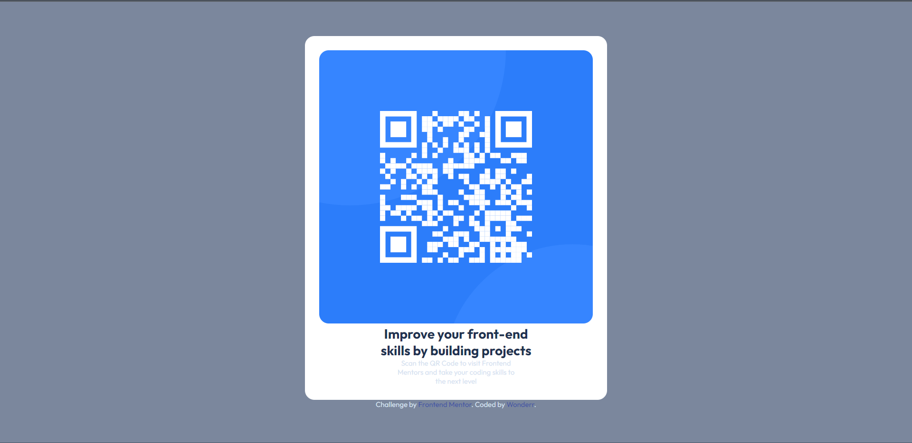

# Frontend Mentor - QR code component solution

This is a solution to the [QR code component challenge on Frontend Mentor](https://www.frontendmentor.io/challenges/qr-code-component-iux_sIO_H). Frontend Mentor challenges help you improve your coding skills by building realistic projects. 

## Overview

### Screenshot

### Links

- Solution URL: [solution URL](https://github.com/belarminojunior/QRCodeComponent)

## My process

### Built with

- Semantic HTML5 markup
- CSS custom properties
- Flexbox

### Useful resources

- [MDN](https://developer.mozilla.org/en-US/) - MDN has been an invaluable tool for me in my journey as a developer. Whenever I encounter a programming challenge or need to understand a particular concept, I turn to MDN for its comprehensive and reliable documentation. The platform covers a wide range of web technologies, including HTML, CSS, JavaScript, and more.

## Author

- Instagram - [Belarmino Simão, Jr](https://www.instagram.com/wonderr____/)
- Frontend Mentor - [@belarminojunior](https://www.frontendmentor.io/profile/belarminojunior)
- Twitter - [@belarmino__jr](https://twitter.com/belarmino__jr)
